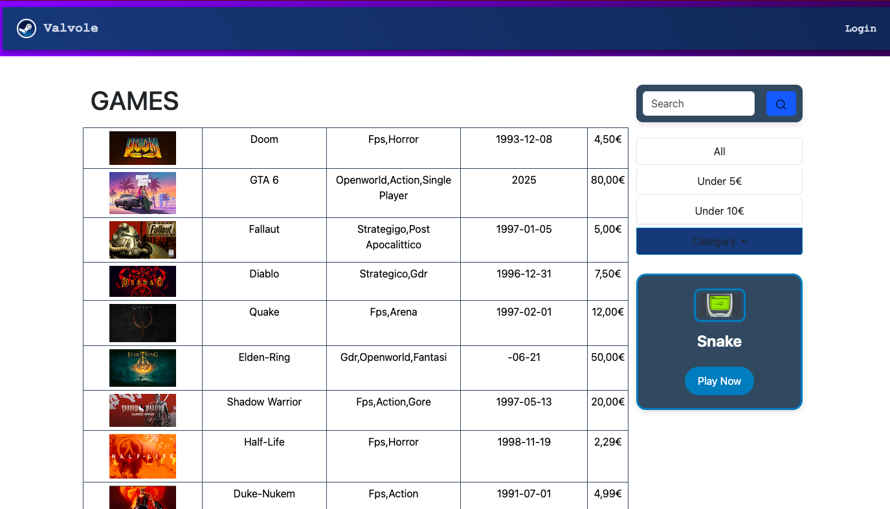

<!-- Badges in alto nel README -->


---
# Steam Clone - Web Application 🎮

Un clone funzionale della celebre piattaforma Steam, sviluppato con un'architettura **Multi-Page Application (MPA)** e rendering interamente gestito lato server. Questo progetto dimostra l'integrazione di un database relazionale leggero, la gestione dinamica delle viste e l'implementazione di pratiche di sicurezza per l'autenticazione.

---

## 🚀 Stack Tecnologico

Il progetto è stato sviluppato utilizzando tecnologie solide e collaudate per il web sviluppo:

### Backend & Logica di Business
*   **JavaScript (ES6+):** Il linguaggio principale utilizzato per l'intera logica di controllo, sia sul server che per eventuali interazioni client-side.
*   **Node.js & Express:** L'ambiente di runtime e il framework principale utilizzati per gestire il server HTTP, le rotte dell'applicazione, i middleware e le richieste dei client.

### Sicurezza & Dati
*   **SQLite3:** Database relazionale leggero e "file-based", integrato direttamente nel progetto per gestire la persistenza dei dati (utenti, catalogo giochi, libreria, ecc.) senza la necessità di un server database esterno.
*   **Bcrypt:** Libreria crittografica utilizzata per l'hashing sicuro delle password degli utenti prima del salvataggio nel database, garantendo la protezione delle credenziali contro attacchi di tipo forza bruta.

### Frontend & Rendering
*   **EJS (Embedded JavaScript):** Template engine utilizzato per il **Server-Side Rendering (SSR)**. Permette di generare HTML dinamico iniettando dati direttamente dal server (es. la lista dei giochi acquistati o il profilo utente) prima di inviare la pagina al browser.
*   **HTML5:** Struttura semantica delle pagine web.
*   **CSS3:** Stile e layout personalizzati per replicare l'interfaccia scura e immersiva tipica di Steam, con un occhio di riguardo alla reattività (responsive design).

---

## 🛠️ Architettura e Funzionamento

L'applicazione sfrutta il pattern del rendering lato server:
1. **Richiesta:** L'utente naviga su una rotta (es. `/store`).
2. **Elaborazione:** Il server Express intercetta la richiesta, esegue le query necessarie sul database `SQLite3` e manipola i dati in modo sicuro.
3. **Rendering:** I dati vengono passati al motore di template `EJS`, che compila i file inserendo le informazioni dinamiche nel codice HTML.
4. **Risposta:** Il server invia al browser una pagina HTML/CSS statica già pronta, ottimizzando i tempi di caricamento iniziali e l'indicizzazione SEO.

---

## 💻 Installazione e Avvio Locale

Per testare il progetto sul tuo computer, assicurati di avere installato [Node.js](https://nodejs.org/) e segui questi passaggi:

1. **Clona il repository:**
```bash
   git clone [https://github.com/PaoloCamedda/Steam_Clone.git](https://github.com/PaoloCamedda/Steam_Clone.git)
   cd Steam_Clone
```

2. **Installa Dipendeze:**
```bash
 npm install
```
3. **Avvia il server:**
```bash
 npm start
```

___

